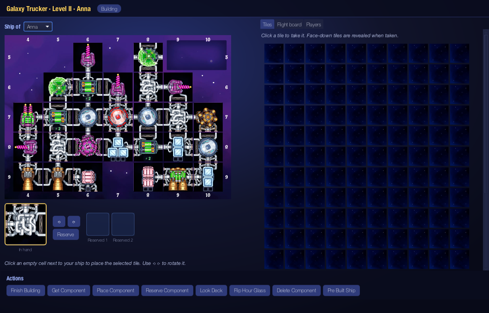
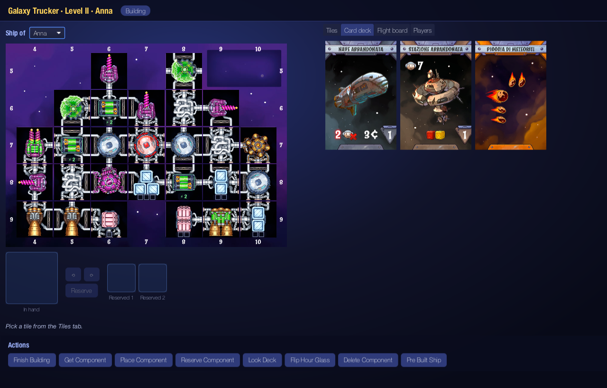
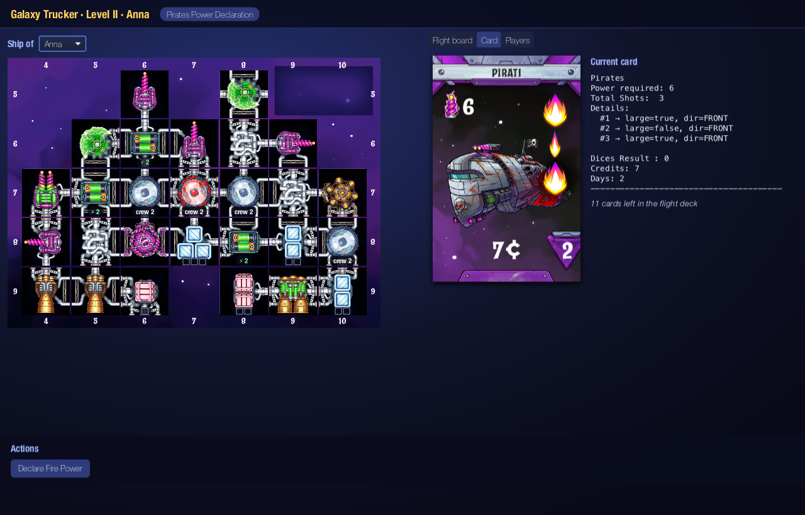
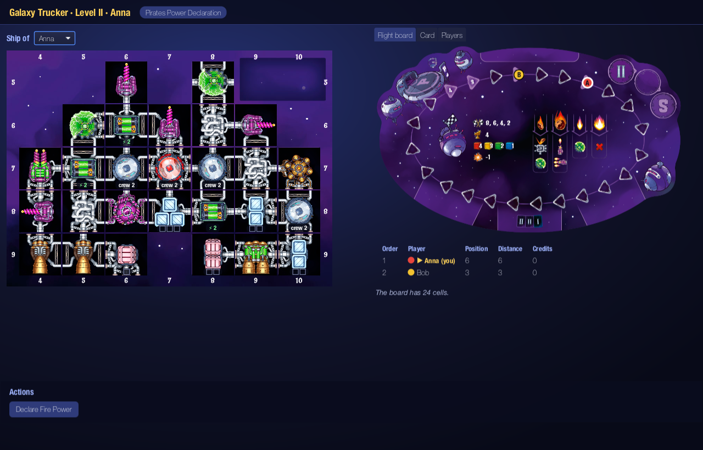

# Galaxy Trucker

A Java implementation of the board game **Galaxy Trucker**: build a spaceship out of sewer-pipe tiles against the clock, then fly it through meteors, pirates and abandoned stations, and try to arrive with more credits than everyone else.

Play over the network with friends, through a graphical client or a text client.



## Features

- **Two game modes:** the *Trial flight* and the full *Level II* game
- **Complete rules:** building phase with hourglass, pre-built ships, crew and alien placement, all adventure cards (Open Space, Planets, Pirates, Smugglers, Slavers, Meteor Swarm, Combat Zone, Epidemic, Stardust, Abandoned Ship and Station), final rewards
- **Graphical client** (JavaFX) using the original board and tile artwork
- **Text client** that works in any terminal
- **Networking** over TCP sockets or Java RMI, with several games running on the same server
- **Resilient to disconnections:** if a player drops out, the game goes on without waiting for them, and they can log back in to take their seat again

## Quick start

### Requirements

- JDK 23 or newer
- Maven 3.9+

On macOS, `brew install openjdk maven` installs both. If `java -version` still shows an older Java, run the jars with `/opt/homebrew/opt/openjdk/bin/java` or put that folder first in your `PATH`.

### Build

```bash
mvn clean package
```

This runs the test suite and creates two jars in `target/`: `GC06-1.0-Server.jar` and `GC06-1.0-Client.jar`. Add `-DskipTests` to build faster.

### Play

Start a server:

```bash
java -jar target/GC06-1.0-Server.jar --hostname localhost
```

Then start one client per player (from other terminals or other computers):

```bash
java -jar target/GC06-1.0-Client.jar
```

In the client, connect to the server, choose a name, and create or join a game. The player who created the game starts it once at least two players have joined.

To play across computers, start the server with your machine's address instead of `localhost` (or without `--hostname` to choose a network interface), and connect the clients to that address.

## Command-line options

| Program | Option | Effect |
|---|---|---|
| Server | `--hostname <name>` | Address to listen on (otherwise you choose a network interface) |
| Server | `--tcp-port <port>` | Port for TCP clients (default `1234`) |
| Server | `--rmi-port <port>` | Port for RMI clients (default `1099`) |
| Client | `--tui` | Use the text client instead of the graphical one |
| Client | `--useTCP` / `--useRMI` | Skip the protocol choice |
| Client | `--localhost` | With `--useTCP` or `--useRMI`: connect straight to `localhost` on the default port |

The server also reads commands from its console: `help`, `games`, `list`, `send <message>` and `stop`.

## How to play (graphical client)

### Building

Pick tiles from the **Tiles** tab: face-down tiles are revealed when you take them. The tile appears **in hand**; rotate it with ⟲ ⟳ and click an empty cell next to your ship to place it. You can keep up to two tiles aside with **Reserve**.

In Level II you can also look at the adventure card decks you will fly through. If you are short on time, **Pre Built Ship** gives you a ready-made ship.



When you are done, press **Finish Building** and choose your starting position. In Level II you then decide where your crew and aliens go: click a cabin and choose **Place humans** or an alien.

### Flight

The leader draws the next adventure card. The **Card** tab shows the card and what it asks for; the buttons at the bottom show exactly what you can do right now.



Click a tile of your ship to act on it: use a battery, lose a crew member, load, move or throw away goods, or remove a damaged tile. Goods offered by a card appear under your ship: select one, then click a cargo hold to load it.

The **Flight board** tab shows where every rocket is, and who is acting.



### If someone loses their connection

The server notices a lost connection within about 10 seconds. A player who leaves the lobby before the game starts is simply removed. During the game, the player keeps their seat: after a 15-second grace period an auto-pilot plays their turns in the most passive way allowed (declaring no extra power, skipping rewards, accepting penalties), so nobody is left waiting. A player who never got to build is given a ready-made ship.

To get back in, start the client again, connect to the same server and log in with **the same name**: you are taken straight back into your game. A game nobody is connected to is closed after two minutes.

## Text client

Run the client with `--tui`. Commands are typed by name, and missing arguments are asked for one at a time, or can be given in one line:

```
declarefirepower 7
placecomponent HAND 6 7 UP
```

- **Origin:** `HAND`, `FIRST_RESERVED`, `SECOND_RESERVED`
- **Orientation:** `UP`, `DOWN`, `LEFT`, `RIGHT`

Ship coordinates use the numbers printed on the board: rows 5–9, columns 4–10.

## Project structure

```
src/main/java
├── Model/        game state: ships, tiles, cards, flight board
├── Controller/   game rules as a state machine, one state per phase and card step
├── Networking/   TCP and RMI transport, messages
└── View/         client: states, actions, text client (TUI) and graphical client (GUI)
```

The client never changes the game directly: every action is a command sent to the server, which validates it and sends the updated game back to every player. UML class diagrams and network sequence diagrams are in [`docs/diagrams`](docs/diagrams).

## Development

```bash
mvn test      # run the ~2000 unit tests
mvn verify    # tests + coverage report in target/site/jacoco/index.html
```

## Credits

Galaxy Trucker is a board game by Vlaada Chvátil, published by Czech Games Edition. The board and tile artwork belongs to them and is used here for a non-commercial project.

This project started as the final team project of the 2025 Software Engineering course at Politecnico di Milano (team GC06), and has been extended since.
